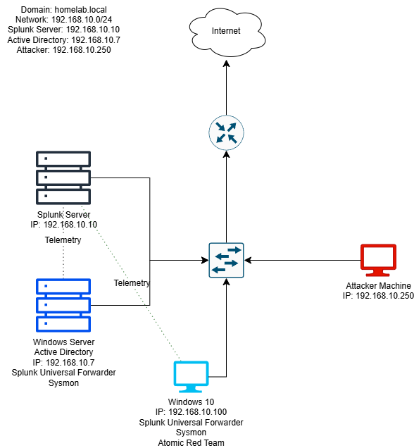

<h1>Active Directory & SIEM Home Lab</h1>

 

<h2>Description</h2>
A basic Active Directory and SIEM lab built in a homelab environment. Includes a domain controller, Windows 10 workstation, Splunk server, and attacker machine to simulate user management, centralized logging, and basic threat detection.
<br />


<h2>Languages and Utilities Used</h2>

- <b>PowerShell</b>
- <b>Command Prompt</b>
- <b>Splunk Universal Forwarder</b>
- <b>Sysmon</b>
- <b>Splunk</b>

<h2>Environments Used </h2>

- <b>Windows Server 2022</b> (21H2) 
- <b>Windows 10</b> (22H2)
- <b>Ubuntu</b> (24.04 LTS)

<h2>Lab Topology:</h2>
<p align="center">


<h2>Program walk-through:</h2>

<p align="center">
Launch the utility: <br/>

<br />


<!--
 ```diff
- text in red
+ text in green
! text in orange
# text in gray
@@ text in purple (and bold)@@
```
--!>
